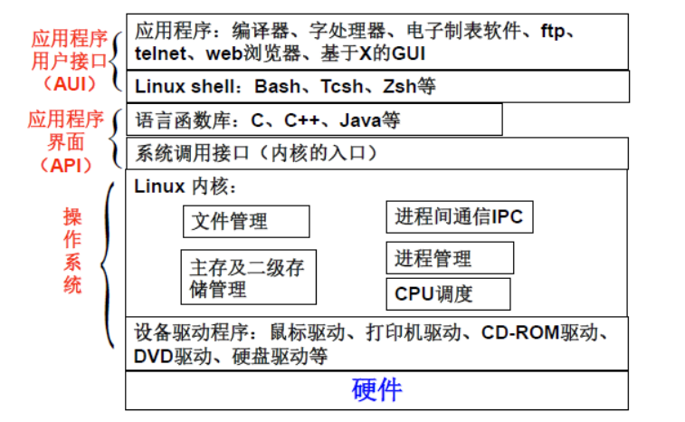

Learn Linux

made by @LeoDuhz, 2020

## 0.Linux Command

## 1.Linux概述

- Linux指的是Linux内核
- Linux操作系统指的是GNU/Linux系统
- Linux系统的组成：内核，C语言库，编译器，工具集和系统的基本工具，Shell，各种应用软件包
- Linux是一个可供多人使用的抢占式多任务操作系统
- GNU project 
- 公用版权协议 General Public Lisence(GPL)
- Linux版本的两种表现形式 Kernel Distribution

## 2.Linux操作系统入门

- User Mode 
  - 用户应用程序
  - 低级别的系统组件
  - C标准库

- Kernel Mode
  - Linux的内核

